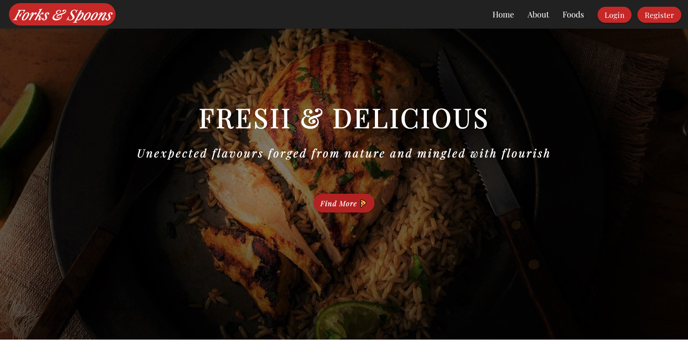
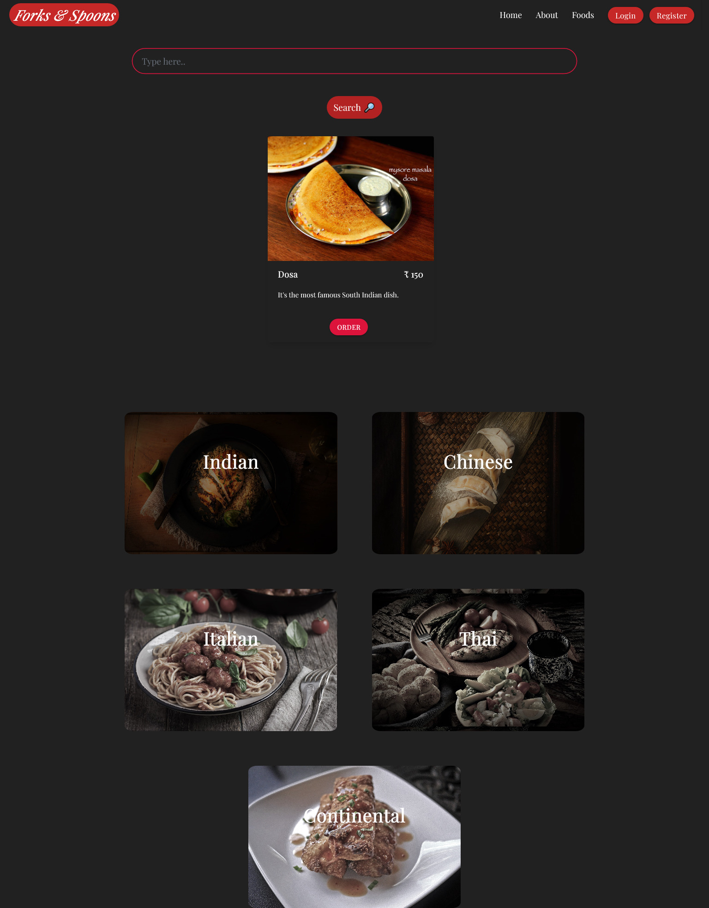
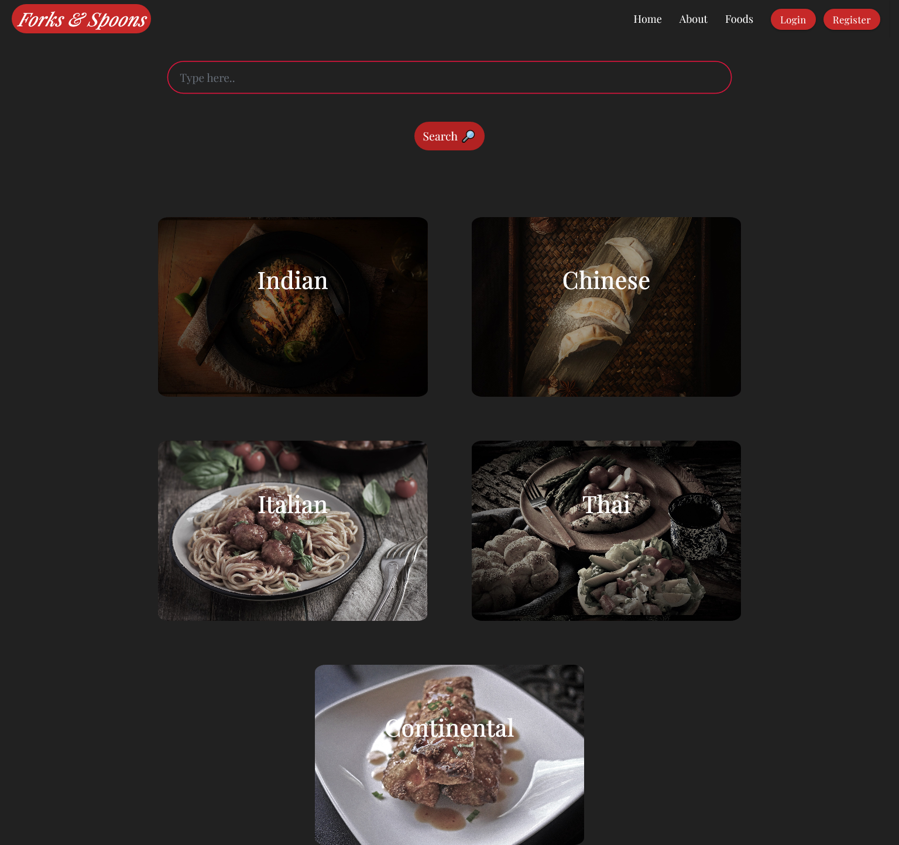
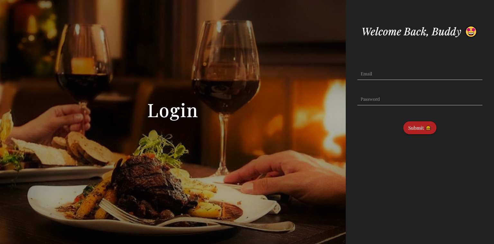

# PHP RESTAURANT PROJECT

A restaurant Project in PHP 🍕🍔

## Features 🍨 

- [x] User Registration &amp; Login
- [x] Food Category &amp; Search
- [ ] Food online delivery
- [ ] Admin Panel

## Preview 👓

Home Page:

Foods Page:

Foods Search:

Register Page:

Login Page:

## To Run In Local Machine 
** You must have xampp installed in your system **
1. Clone the Repo
2. Put it into your htdocs folder